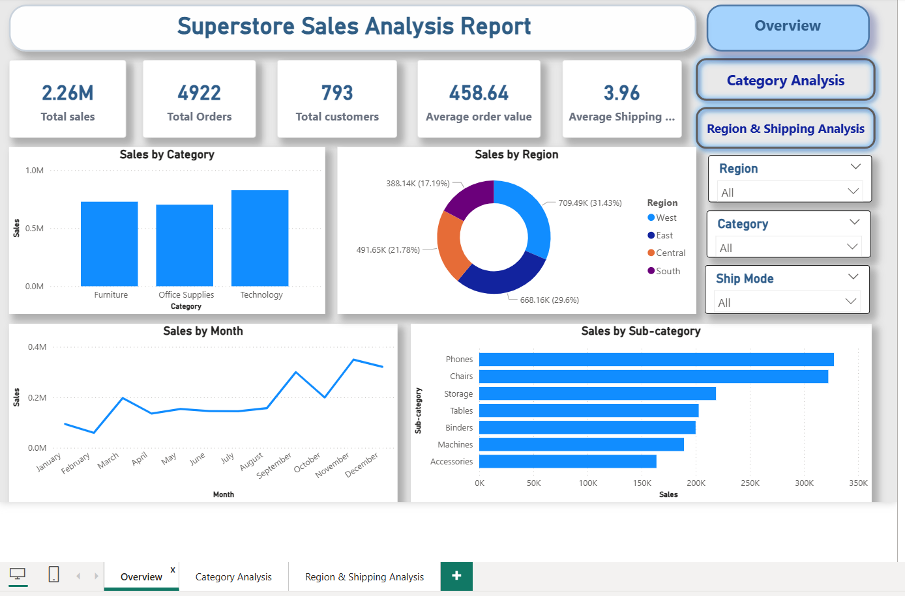
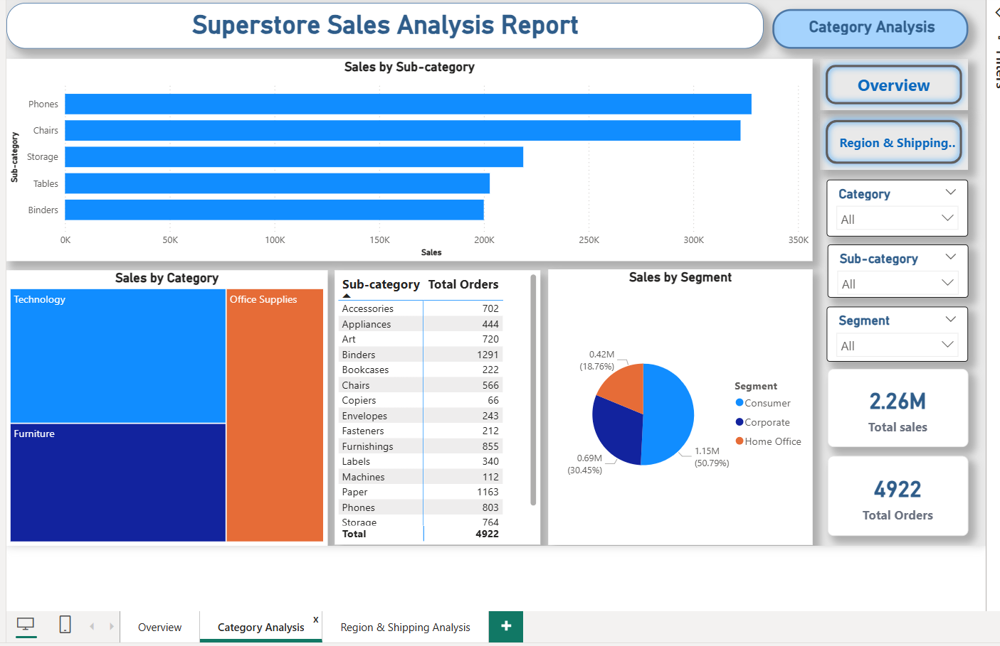
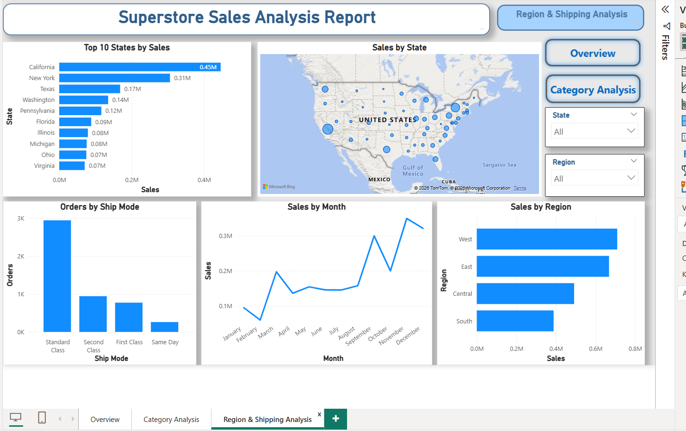

# Superstore Sales Analysis – Power BI

## Project Overview

This project presents an interactive **Superstore Sales Analysis dashboard** built using **Microsoft Power BI**. The objective is to analyze sales performance across categories, sub-categories, regions, states, customer segments, shipping modes, and months.

## Tools & Technologies

- Microsoft Power BI
- Power Query
- Microsoft Excel
- Data Cleaning & Transformation
- Data Visualization
- KPI Analysis

## Dataset

The project uses Superstore sales data containing sales and order-related information.

The dataset was cleaned and prepared before creating the Power BI report.

## Dashboard Pages

### Overview

The Overview page provides a high-level view of business performance, including:

- Total Sales
- Total Orders
- Total Customers
- Average Order Value
- Average Shipping Time
- Sales by Category
- Sales by Region
- Sales by Month
- Sales by Sub-category

The report shows total sales of approximately **2.26M** and **4,922 total orders**.

### Category Analysis

This page focuses on product and customer analysis:

- Sales by Sub-category
- Sales by Category
- Total Orders by Sub-category
- Sales by Customer Segment

The customer segments shown are **Consumer, Corporate, and Home Office**.

### Region & Shipping Analysis

This page analyzes geographic and shipping performance:

- Top 10 States by Sales
- Sales by State
- Orders by Ship Mode
- Sales by Month
- Sales by Region

The report identifies **California** as the highest-sales state among the displayed top states, and **West** as the highest-sales region.

## Key Skills Demonstrated

- Data cleaning and preprocessing
- Data transformation using Power Query
- KPI creation
- Interactive dashboard design
- Sales trend analysis
- Category and sub-category analysis
- Regional analysis
- Customer segment analysis
- Shipping mode analysis
- Business insight generation

## Project Files

- `dataset.csv` – Source dataset
- `Superstore Sales Data Cleaning.xlsx` – Excel data cleaning/preparation file
- `superstore sales dataset_preprocessing report.docx` – Data preprocessing documentation
- `Superstore sales analysis.pdf` – Exported Power BI dashboard
- `page1.png` – Overview dashboard screenshot
- `page2.png` – Category Analysis dashboard screenshot
- `page3.png` – Region & Shipping Analysis dashboard screenshot

## Dashboard Preview

### Overview

### Category Analysis

### Region & Shipping Analysis

